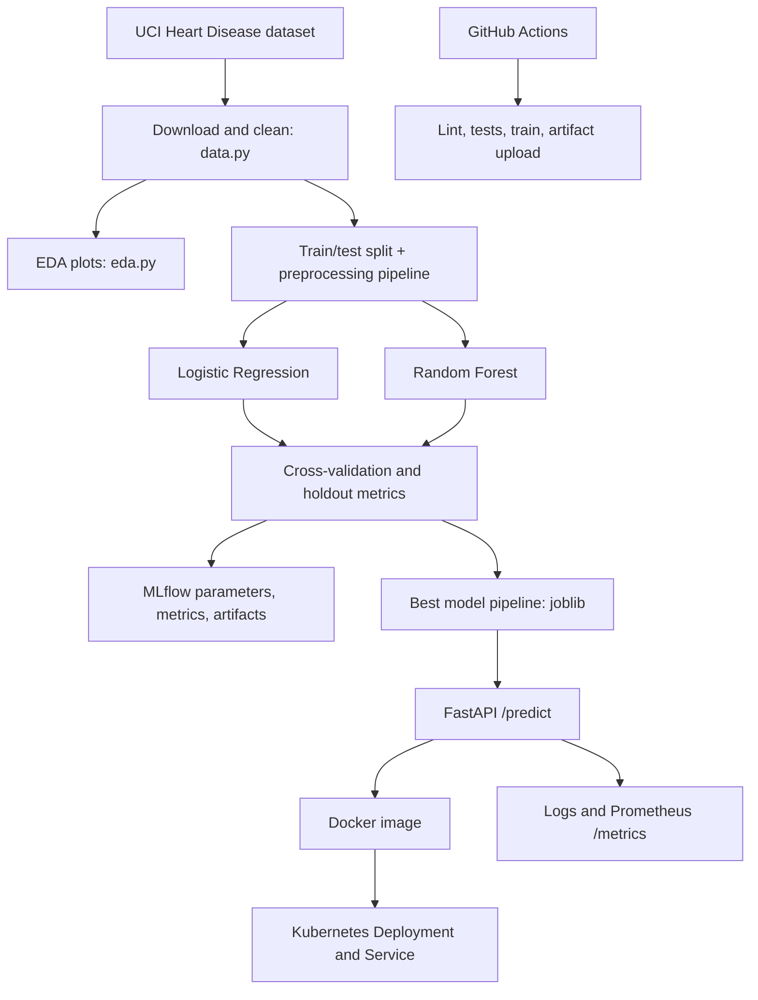

# Architecture and workflow

```mermaid
flowchart TD
    A[UCI Heart Disease dataset] --> B[Download and clean: data.py]
    B --> C[EDA plots: eda.py]
    B --> D[Train/test split + preprocessing pipeline]
    D --> E[Logistic Regression]
    D --> F[Random Forest]
    E --> G[Cross-validation and holdout metrics]
    F --> G
    G --> H[MLflow parameters, metrics, artifacts]
    G --> I[Best model pipeline: joblib]
    I --> J[FastAPI /predict]
    J --> K[Docker image]
    K --> L[Kubernetes Deployment and Service]
    J --> M[Logs and Prometheus /metrics]
    N[GitHub Actions] --> O[Lint, tests, train, artifact upload]
```

Update this diagram if your final implementation differs.
